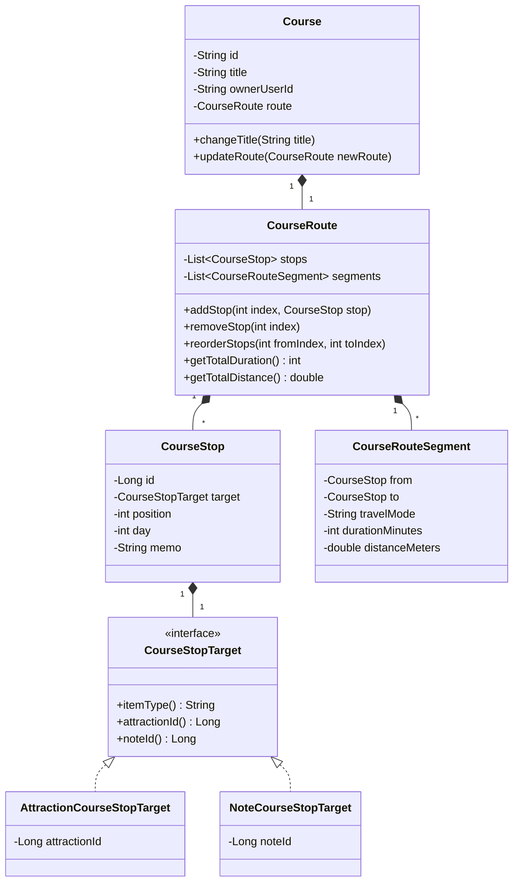

# 코스(Course) 도메인 설계 분석 및 최종 개선 목표

> 상태: active에서 execute로 이동한 기존 코스 도메인 분석 계획이다.

## 1. 개요
현재 동네핀의 코스(Course) 설계는 도메인 본연의 역할과 객체 간의 관계를 다루기보다 데이터베이스 테이블 구조를 그대로 클래스로 옮겨 놓은 **데이터베이스 중심의 빈약한 도메인 모델(Anemic Domain Model)** 형태를 취하고 있습니다. 

본 문서는 현재 코스 도메인의 구조적 특징과 한계를 분석하고, 최종적으로 `CourseRoute`가 순서 있는 경유지(`CourseStop`)와
경유지 사이 이동 구간(`CourseRouteSegment`)을 함께 소유하는 구조로 개선하기 위한 설계 방향을 제안합니다.

---

## 2. 현재 설계 분석 및 한계점

### ① 연결(Link) 및 이동(Transition) 개념의 부재
코스는 단순히 장소들의 집합이 아니라, **"출발지부터 목적지까지 순서대로 이어지는 동선과 이동 흐름"**입니다.
* **현 구조**: [CourseRouteItem](file:///Users/hj.park/projects/local-enjoy-trip-backend/core/core-api/src/main/java/com/ssafy/enjoytrip/core/domain/CourseRouteItem.java)은 단지 `position`(순서) 번호를 컬럼으로 가질 뿐, 이전 경유지나 다음 경유지와의 유기적인 연결 관계를 도메인 객체 레벨에서 모릅니다.
* **한계**: 1번 장소에서 2번 장소로 갈 때의 이동 수단, 소요 시간, 거리, 상세 이동 경로(LineString) 등 **연결성(Edge)** 정보를 도메인 모델에 반영할 수 없습니다. 이로 인해 코스의 순서를 변경하거나 중간에 노드를 삽입할 때, 도메인 내부에서 스스로 링크를 조정하지 못하고 서비스 레이어([CourseService](file:///Users/hj.park/projects/local-enjoy-trip-backend/core/core-api/src/main/java/com/ssafy/enjoytrip/core/domain/service/CourseService.java))에서 리스트 인덱스를 매번 새로 매겨 전체를 지우고 새로 쓰는 절차지향적 방식을 사용하게 됩니다.

### ② 다형성(Polymorphism) 추상화의 부재
코스의 경유지(Stop)는 공공 관광지(`ATTRACTION`)와 사용자 작성 쪽지(`NOTE`) 두 가지 타입이 올 수 있습니다. 이 둘은 지도상에 실존하며 코스에 등록될 수 있는 공통 속성(이름, 좌표 등)을 갖습니다.
* **현 구조**: 데이터베이스의 배타적 논리합(XOR) 구조(`CHECK` 제약조건 및 Nullable 외래키 필드들)를 그대로 도메인에 매핑하여, `CourseRouteItem` 내에 `itemType`, `attractionId`, `noteId` 등의 필드가 모두 혼재되어 있습니다.
* **한계**: 새로운 경유지 타입이 추가될 때마다 분기 처리가 늘어나며, OCP(개방-폐쇄 원칙)를 위배하는 구조가 됩니다.

### ③ 빈약한 도메인 모델 (Anemic Domain Model)
* **현 구조**: [Course](file:///Users/hj.park/projects/local-enjoy-trip-backend/core/core-api/src/main/java/com/ssafy/enjoytrip/core/domain/Course.java) 및 `CourseRouteItem`은 데이터를 보관하기만 하는 자바 `record` 형태입니다.
* **한계**: 비즈니스 검증, 순서 변경, 총 소요 시간 및 거리 계산 등 코스의 핵심 행위(Behavior)가 도메인 내부가 아닌 `CourseService`에 절차지향적인 코드로 흩어져 있어 응집도가 낮습니다.

---

## 3. 도메인 중심의 최종 개선 방향

코스를 단순 `items[]` 모음이 아니라 **순서 있는 경유지 목록과 인접 경유지 사이 이동 구간을 가진 Route Aggregate**로 재구성합니다.
구현상 stop 객체가 직접 previous/next 참조를 들 필요는 없습니다. 순서는 `CourseRoute.stops()`와 `position`으로 유지하고,
이동 정보는 `CourseRouteSegment`로 분리합니다.



### 1) 경유지 대상의 다형성 추상화
관광지와 쪽지를 동일한 경유지 성격의 상위 인터페이스로 추상화하여 구체적인 타입 결합도를 낮춥니다.
```java
public sealed interface CourseStopTarget permits AttractionCourseStopTarget, NoteCourseStopTarget {
    String itemType();

    Long attractionId();

    Long noteId();
}
```

### 2) 경유지 간 이동 구간(Segment)과 경로(Route)의 일급 객체화
경유지와 경유지 사이의 이동 구간을 명시적인 도메인 모델로 정의하고, stop/segment 묶음을 `CourseRoute`라는 일급 컬렉션 겸 도메인 객체로 정의합니다.
```java
// 경유지 간 이동 경로 및 소요 시간 정의
public record CourseRouteSegment(
    CourseStop from,
    CourseStop to,
    TravelMode travelMode,    // 이동 수단 (도보, 차량 등)
    int durationMinutes,      // 소요 시간
    double distanceMeters     // 이동 거리
) {}

// stop 순서와 segment 정합성을 제어하는 도메인
public class CourseRoute {
    private final List<CourseStop> stops;
    private final List<CourseRouteSegment> segments;

    public CourseRoute(List<CourseStop> stops, List<CourseRouteSegment> segments) {
        this.stops = reindex(stops);
        this.segments = List.copyOf(segments);
        validateSegmentsConnectAdjacentStops();
    }

    public CourseRoute replaceStops(List<CourseStop> newStops) {
        return new CourseRoute(newStops, List.of());
    }

    public CourseRoute replaceSegments(List<CourseRouteSegment> newSegments) {
        return new CourseRoute(stops, newSegments);
    }

    public int getTotalDuration() {
        return segments.stream().mapToInt(CourseRouteSegment::durationMinutes).sum();
    }
}
```

---

## 4. 기대 효과
1. **행위 중심의 코드 격리**: 순서 변경, 경로 계산 등의 코스 비즈니스 로직이 서비스 레이어에서 격리되어 도메인 객체 내로 캡슐화됩니다.
2. **이동 정보 확장성**: 멈춤 정보(Node)와 이동 경로(Edge)가 구분되므로, 향후 도보/차량별 이동 시간 및 거리 예측 등 고도화된 기능 확장이 쉬워집니다.
3. **비즈니스 정합성 유지**: 도메인 내부에서 스스로 링크의 유효성(끊어짐 방지 등)을 강제할 수 있어 비즈니스 정합성이 상시 보장됩니다.

---

## 5. 검토 결과: 최종 목표는 `순서 있는 Stop + 이동 Segment를 가진 CourseRoute Aggregate`다

위 분석의 문제의식은 맞다. 현재 `Course`와 `CourseRouteItem`은 코스의 순서, 경유지 타입, 소유권 일부를 데이터로 들고 있고,
`CourseService`/`AdminCourseService`가 항목 검증, 정렬, position 재부여, storage 변환을 대부분 수행한다.

수정은 “안전한 1차 정리”에서 끝내면 안 된다. 최종 목표는 다음 상태다.

```text
Course
 └─ CourseRoute
     ├─ ordered stops: CourseStop[]
     │   ├─ AttractionCourseStopTarget
     │   └─ NoteCourseStopTarget
     └─ segments: CourseRouteSegment[]
         └─ stop[i] -> stop[i + 1] 이동 정보
```

최종 상태에서 코스 도메인은 다음을 스스로 표현해야 한다.

- 코스는 단순 장소 묶음이 아니라 **순서 있는 경유지 목록과 경유지 사이 이동 구간의 합성체**다.
- `position`은 DB 정렬용 숫자이면서 도메인 route의 직렬화 결과다. caller가 임의로 빈 position이나 중복 position을 유지하게 두지 않는다.
- attraction/note의 배타적 선택은 nullable FK 조합이 아니라 `CourseStopTarget` 타입으로 표현한다.
- 이동 거리, 이동 시간, 이동 수단, 경로 geometry/polyline은 stop의 속성이 아니라 인접 stop 사이의 `CourseRouteSegment` 속성이다.
- 코스 생성/수정 시 route ordering/optimization은 프론트엔드 별도 API 오케스트레이션이 아니라 백엔드 저장 흐름 안에서 결정한다.
- service는 transaction, 저장소 조회, 외부 route provider 호출, mapper 변환을 맡고, route 자체의 정합성은 `CourseRoute`가 맡는다.

따라서 “몇 차로 나눌지”는 실행 순서일 뿐이고, 최종 완료 기준은 아래 6장의 목표 상태 전체다.

---

## 6. 최종 목표 설계

### 6.1 Domain model

최종 도메인 모델은 다음 구조를 목표로 한다.

```java
public record Course(
        String id,
        String ownerUserId,
        String title,
        String regionName,
        String visibility,
        String status,
        String description,
        String coverImageUrl,
        String curationSection,
        Integer curationOrder,
        int saveCount,
        String createdAt,
        String updatedAt,
        CourseRoute route
) {
    public void requireOwnedBy(String userId) {
        ...
    }
}
```

```java
public final class CourseRoute {
    private final List<CourseStop> stops;
    private final List<CourseRouteSegment> segments;

    private CourseRoute(List<CourseStop> stops, List<CourseRouteSegment> segments) {
        this.stops = List.copyOf(stops);
        this.segments = List.copyOf(segments);
        validateSegmentsConnectAdjacentStops();
    }

    public static CourseRoute withoutSegments(List<CourseStop> stops) {
        return new CourseRoute(reindex(stops), List.of());
    }

    public static CourseRoute withSegments(List<CourseStop> stops, List<CourseRouteSegment> segments) {
        return new CourseRoute(reindex(stops), segments);
    }

    public List<CourseStop> stops() {
        return stops;
    }

    public List<CourseRouteSegment> segments() {
        return segments;
    }

    public int totalDurationSeconds() {
        return segments.stream().mapToInt(CourseRouteSegment::durationSeconds).sum();
    }

    public long totalDistanceMeters() {
        return segments.stream().mapToLong(CourseRouteSegment::distanceMeters).sum();
    }
}
```

`CourseRoute`의 최종 책임:

- stop 순서를 1부터 연속 position으로 정규화한다.
- stop 중복/빈 route/segment 연결 불일치 같은 route 내부 불변식을 검증한다.
- segment가 있으면 `segment[i].from == stop[i]`, `segment[i].to == stop[i + 1]` 관계를 보장한다.
- 총 이동 시간/거리 같은 route aggregate 계산을 제공한다.

`CourseRoute`가 맡지 않는 책임:

- DB 조회/저장
- attraction/note 존재 여부와 공개 상태 조회
- 외부 길찾기 API 호출
- transaction 제어
- HTTP 요청 parsing/defaulting

이 책임들은 현재 모듈 규칙대로 `core-api` service, web DTO, `storage:db-core` mapper에 둔다.

### 6.2 Stop target

현재 `CourseRouteItem`은 실제로는 route edge가 아니라 코스 경유지다. 최종 이름은 다음처럼 맞춘다.

- `CourseRouteItem` → `CourseStop`
- `itemType + attractionId + noteId` → `CourseStopTarget`
- `List<CourseRouteItem>` → `CourseRoute`

```java
public record CourseStop(
        Long id,
        CourseStopTarget target,
        int position,
        int day,
        String memo,
        Integer stayMinutes,
        String title
) {
}
```

```java
public sealed interface CourseStopTarget permits AttractionCourseStopTarget, NoteCourseStopTarget {
    String itemType();

    Long attractionId();

    Long noteId();
}

public record AttractionCourseStopTarget(Long attractionId) implements CourseStopTarget {
    public String itemType() {
        return "ATTRACTION";
    }

    public Long noteId() {
        return null;
    }
}

public record NoteCourseStopTarget(Long noteId) implements CourseStopTarget {
    public String itemType() {
        return "NOTE";
    }

    public Long attractionId() {
        return null;
    }
}
```

DB는 `item_type`, `attraction_id`, `note_id`의 XOR 제약을 유지한다. 저장소에는 맞는 구조다.
하지만 도메인과 service caller는 nullable FK 조합을 직접 조립하지 않고 `CourseStopTarget`으로 의도를 표현한다.

### 6.3 Segment / Edge

최종적으로 이동 구간은 stop이 아니라 stop 사이의 segment로 둔다.

```java
public record CourseRouteSegment(
        CourseStop from,
        CourseStop to,
        TravelMode travelMode,
        int durationSeconds,
        long distanceMeters,
        String encodedPolyline
) {
}
```

주의점:

- stop 자체를 linked-list node로 만들어 `previous`/`next` 참조를 들게 하지 않는다.
- 순서의 단일 진실은 여전히 `CourseRoute.stops()`와 `position`이다.
- segment는 인접 stop 사이 결과값이다.
- 외부 route provider 호출은 service/collaborator가 수행하고, domain은 계산된 segment의 정합성과 합계만 책임진다.

### 6.4 Storage final shape

현재 `courses`, `course_items`는 유지하되, 최종적으로 segment 저장 테이블을 추가한다.

```text
courses
- id
- owner_user_id
- title
- region_name
- visibility
- status
- description
- cover_image_url
- route_line geometry(LineString, 4326)       -- 전체 경로 요약선, 선택 유지
- started_at
- completed_at
- created_at
- updated_at
- deleted_at

course_items
- id
- course_id
- item_type
- attraction_id
- note_id
- position
- day
- memo
- stay_minutes
- completed_at
- created_at

course_route_segments
- id
- course_id
- from_course_item_id
- to_course_item_id
- segment_order
- travel_mode
- duration_seconds
- distance_meters
- route_line geometry(LineString, 4326)       -- PostGIS 사용 시
- encoded_polyline varchar/text               -- provider polyline을 보존할 때
- created_at
```

제약:

- `course_route_segments.course_id`는 `courses.id`를 FK로 참조한다.
- `from_course_item_id`, `to_course_item_id`는 `course_items.id`를 FK로 참조한다.
- `segment_order`는 1부터 시작하고, stop 개수가 N이면 segment 개수는 N-1이다.
- 같은 course 안에서 `segment_order`는 unique다.
- segment 저장은 route provider 결과가 있는 코스에만 생길 수 있다. provider 결과가 없는 초기 단계에서는 빈 segments를 허용한다.

### 6.5 API final shape

기존 `items[]` 응답은 유지하면서, 최종적으로 route 요약과 segments를 추가한다.
계약 변경은 breaking change로 만들지 말고 필드 추가로 확장한다.

```json
{
  "id": "course-1",
  "title": "서울 산책",
  "items": [
    {
      "id": 1,
      "itemType": "ATTRACTION",
      "attractionId": 10,
      "noteId": null,
      "position": 1,
      "day": 1,
      "memo": null,
      "stayMinutes": 30,
      "title": "경복궁"
    }
  ],
  "routeSummary": {
    "totalDurationSeconds": 1800,
    "totalDistanceMeters": 2400
  },
  "segments": [
    {
      "fromItemId": 1,
      "toItemId": 2,
      "travelMode": "WALK",
      "durationSeconds": 600,
      "distanceMeters": 800,
      "encodedPolyline": "..."
    }
  ]
}
```

요청 계약:

- 프론트엔드는 경유지 후보와 사용자가 의도한 순서를 보낸다.
- 최종 저장 순서와 route segment 계산은 백엔드가 책임진다.
- 자동 최적화 여부는 요청 옵션이나 서버 정책으로 표현할 수 있지만, 별도 `/routes/optimizations` 호출을 프론트가 조립하는 흐름으로 되돌리지 않는다.

---

## 7. 구현 로드맵: 단계는 나누되 완료 목표는 6장 전체다

### Phase A. 현재 계약 잠금

목표: 리팩터링 전에 기존 API와 저장 규칙을 테스트로 고정한다.

- `CourseControllerTest`
  - `POST /api/courses` 요청/응답 shape 유지
  - `items[].itemType`, `attractionId`, `noteId`, `position` 응답 유지
- `CourseServiceTest`
  - 생성 시 입력 position이 정렬되고 저장 position은 1부터 재부여되는지 검증
  - `ATTRACTION`/`NOTE` target 검증이 유지되는지 검증
- `AdminCourseServiceTest`
  - 관리자 코스도 같은 route 저장 규칙을 따르는지 검증

완료 조건: 테스트가 현재 동작을 설명하고, 이후 타입 변경에서 회귀를 잡을 수 있다.

### Phase B. Stop/Route 도메인 언어 정리

목표: DB row mirror 모델을 없애고, 순서 있는 경유지 route를 도메인 타입으로 만든다.

- `CourseRoute` 추가
- `CourseStop` 추가
- `CourseStopTarget`, `AttractionCourseStopTarget`, `NoteCourseStopTarget` 추가
- `Course.items`를 `Course.route`로 변경
- web response에서는 기존 `items[]` shape를 유지하되 `course.route().stops()`에서 만든다.
- `CourseItemRequest.toRouteItem()`은 `toCourseStop()`으로 바꾼다.
- service는 `CourseRoute.stops()` 기준으로 `CourseItemRecord`를 저장한다.

완료 조건: public API/DB는 그대로지만, core domain에서 `CourseRouteItem`과 nullable FK 조합이 사라진다.

### Phase C. 백엔드 주도 route ordering/optimization 정착

목표: 코스 생성/수정 저장 흐름에서 최종 순서를 서버가 결정한다.

- `CourseRoutePlanner` 또는 더 구체적인 이름의 collaborator를 둔다.
- 입력 route가 들어오면 service가 planner에 최종 route 생성을 위임한다.
- planner는 현재는 position 정규화만 해도 된다.
- 추후 좌표 기반 최적화가 들어와도 controller/API 흐름은 바뀌지 않는다.
- 최적화 실패 정책을 명시한다.
  - 제품 정책이 “항상 저장”이면 원래 순서로 저장하고 실패를 로그/metadata로 남긴다.
  - 제품 정책이 “최적화 필수”이면 표준 오류 응답으로 실패한다.

완료 조건: 프론트엔드가 별도 최적화 API를 호출하지 않아도, 코스 생성/수정 결과는 백엔드에서 정규화된 route로 저장된다.

### Phase D. Segment 저장소와 mapper 추가

목표: stop 사이 이동 정보를 실제 저장/조회 가능한 제품 계약으로 만든다.

- Flyway migration 추가
  - `course_route_segments`
  - FK/unique/check/index
- `CourseRouteSegmentRecord` 추가
- `CourseMapper` 또는 별도 narrow mapper에 segment insert/delete/find 추가
- route 저장 시 stop 저장 후 생성된 item id를 기준으로 segment를 저장한다.
- course 조회 시 items와 segments를 함께 읽어 `CourseRoute.withSegments(...)`를 만든다.

완료 조건: 이동 시간/거리/수단/경로가 DB에 저장되고, 조회 시 domain route에 복원된다.

### Phase E. API route summary/segments 확장

목표: 저장된 segment를 클라이언트가 사용할 수 있게 응답 계약을 확장한다.

- `CourseResponse`에 `routeSummary` 추가
- `CourseResponse`에 `segments` 추가
- 기존 `items[]`는 유지한다.
- Swagger/OpenAPI/Controller test를 갱신한다.
- 실제 JSON 응답으로 shape를 확인한다.

완료 조건: 코스 상세/목록 응답에서 stop 목록과 이동 구간 정보가 함께 내려간다.

### Phase F. 전체 route 고도화

목표: 코스가 진짜 “이동 가능한 동선”으로 동작하게 한다.

- 외부 route provider 또는 내부 알고리즘으로 인접 stop 간 segment를 계산한다.
- `courses.route_line`에 전체 LineString 요약을 저장한다.
- `CourseRoute.totalDurationSeconds()`/`totalDistanceMeters()`가 응답 summary와 일치한다.
- stop 변경/삭제/재정렬 시 관련 segment를 재계산하거나 폐기한다.

완료 조건: 코스 생성/수정 후 저장된 course는 stop 순서, segment, 전체 route summary가 서로 일관된다.

---

## 8. 최종 완료 기준

이 설계 작업은 아래가 모두 끝나야 “완료”다.

- domain에 `CourseRoute`, `CourseStop`, `CourseStopTarget`, `CourseRouteSegment`가 존재한다.
- `CourseRouteItem` row-mirror 도메인 타입은 제거된다.
- service는 route 정합성을 직접 list index로 관리하지 않고 `CourseRoute`를 통해 저장한다.
- 생성/수정 시 최종 route 순서는 백엔드가 결정한다.
- DB에는 stop 저장용 `course_items`와 segment 저장용 `course_route_segments`가 함께 존재한다.
- 조회 시 `course_items + course_route_segments`가 하나의 `CourseRoute`로 복원된다.
- API는 기존 `items[]`를 유지하면서 `routeSummary`, `segments`를 제공한다.
- tests는 domain route invariant, service save flow, mapper segment persistence, controller JSON shape를 모두 검증한다.
- 로컬 실행 가능한 상태라면 실제 `POST /api/courses`와 조회 API JSON으로 최종 shape를 확인한다.

---

## 9. 검증 계획

코드 수정 시 최소 검증:

```bash
./gradlew :core:core-api:check
```

DB/migration 또는 mapper XML 변경 시:

```bash
./gradlew :storage:db-core:test
./gradlew :core:core-api:check
```

PostGIS `route_line`이나 geometry 검증이 들어가면 Docker가 가능한 환경에서 container tag도 실행한다.

```bash
./gradlew :storage:db-core:test -PincludeContainerTests=true
```

public API 응답 shape가 바뀌면 로컬 런타임에서 실제 JSON 응답을 확인한다.

---

## 10. 문서 수정 방향

이 문서는 “1차 안전 정리” 문서가 아니라 최종 설계 문서여야 한다.
따라서 제목과 본문을 다음 방향으로 정리한다.

1. 제목을 `코스 도메인 설계 분석 및 최종 개선 목표`로 바꾼다.
2. `Linked List/Directed Graph` 표현은 구현 전술이 아니라 “순서 있는 stop과 stop 사이 segment를 가진 route aggregate”로 바꾼다.
3. 중간 단계는 실행 순서로만 둔다.
4. 최종 완료 기준은 8장처럼 domain, storage, API, tests, runtime proof까지 포함한다.
5. DB 구조를 당장 유지하는 단계가 있더라도, 최종 목표에는 `course_route_segments` 추가를 명시한다.
6. 백엔드 주도 코스 최적화는 선택 아이디어가 아니라 최종 저장 흐름의 책임으로 명시한다.
