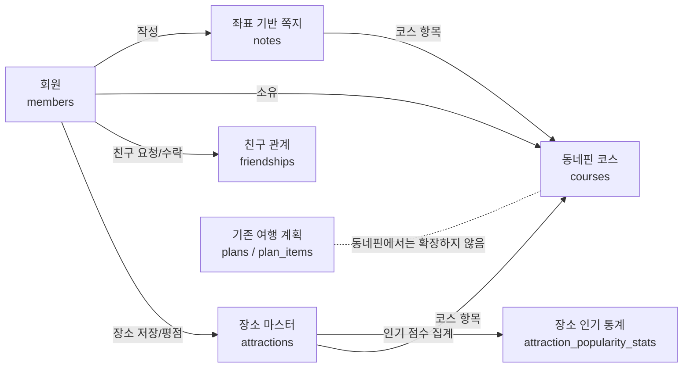
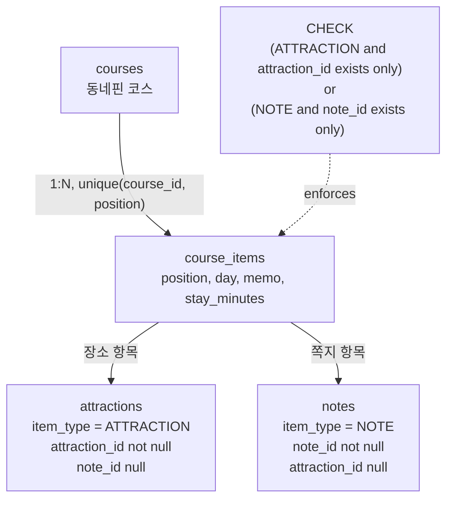
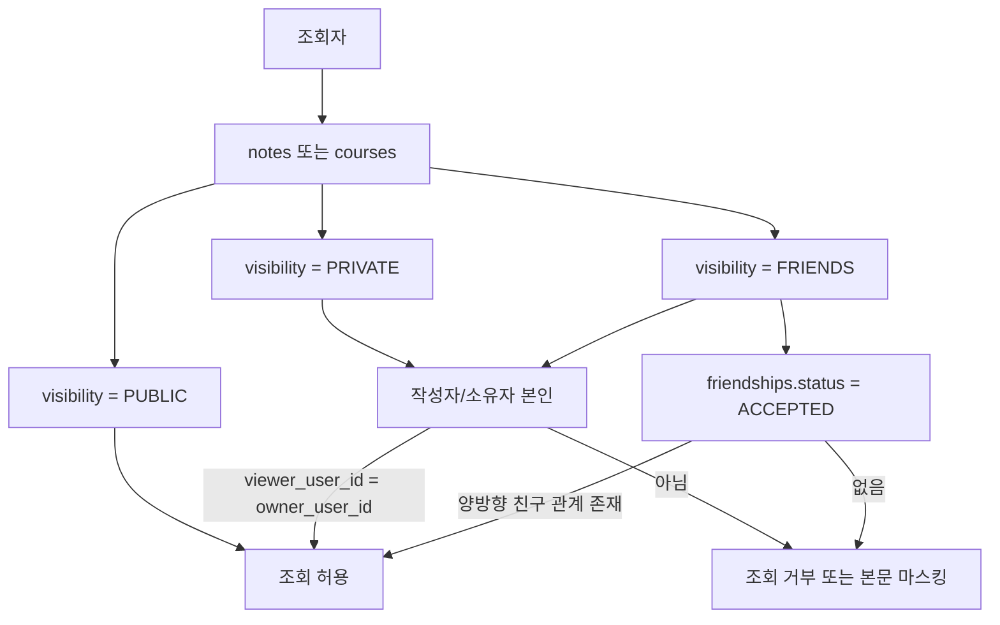
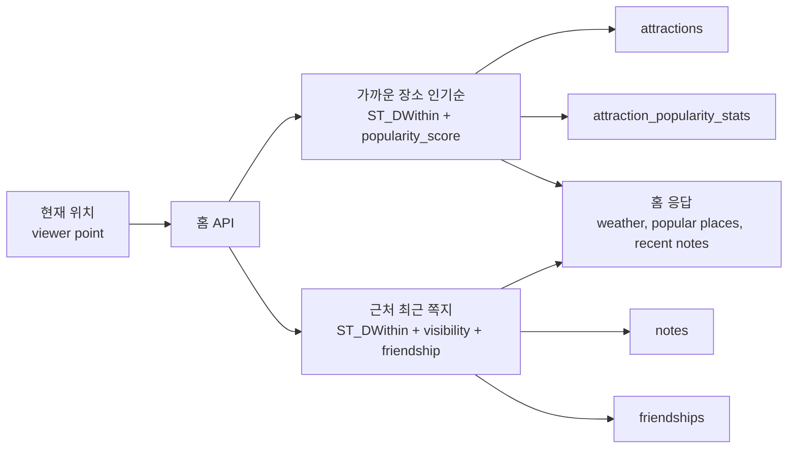
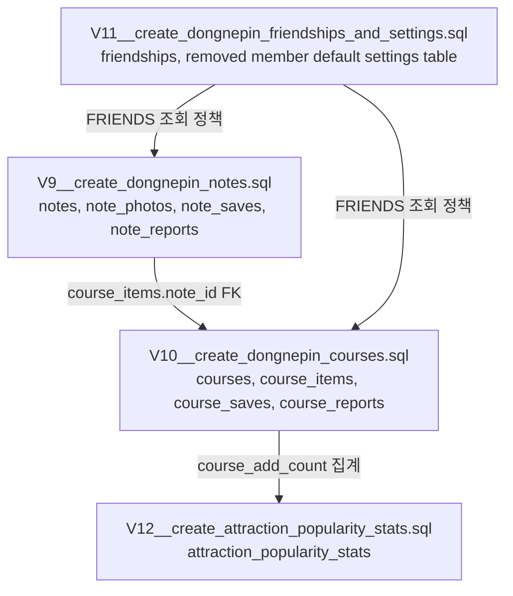

# 동네핀 DB ERD 설계

작성일: 2026-06-09
기준 요구사항: `docs/project/dongnepin-requirements.md`

## 1. 다이어그램 요약

동네핀은 기존 여행 계획 테이블을 확장하지 않고, 위치 기반 쪽지와 코스를 별도 도메인으로 분리한다.

- 기존 `members`, `attractions`, `attraction_favorites`, `attraction_ratings`는 재사용한다.
- 기존 `plans`, `plan_items`는 기존 여행 계획 API 호환용으로 남긴다.
- 동네핀 코스는 신규 `courses`, `course_items`가 담당한다.
- 쪽지는 장소가 아니므로 `attractions`가 아니라 `notes`에 독립 좌표 콘텐츠로 저장한다.
- 공개 범위는 쪽지와 코스가 같은 값을 쓴다: `PUBLIC`, `FRIENDS`, `PRIVATE`.



## 2. 전체 ERD 설계도

```mermaid
erDiagram
    members {
        bigint id PK
        varchar user_id UK
        varchar name
        varchar email
        varchar password
        timestamp created_at
        timestamp updated_at
    }

    attractions {
        bigint id PK
        varchar title
        varchar addr1
        varchar addr2
        varchar first_image
        varchar content_type_id
        integer read_count
        integer sido_code
        integer gugun_code
        geometry_Point_4326 location
        timestamp created_at
    }

    attraction_favorites {
        bigint id PK
        bigint attraction_id FK
        varchar user_id
        timestamp created_at
    }

    attraction_ratings {
        bigint id PK
        bigint attraction_id FK
        varchar user_id
        integer rating
        timestamp created_at
        timestamp updated_at
    }

    attraction_popularity_stats {
        bigint attraction_id PK, FK
        integer favorite_count
        integer rating_count
        numeric average_rating
        integer view_count
        integer course_add_count
        numeric popularity_score
        timestamp updated_at
    }

    notes {
        bigint id PK
        varchar author_user_id FK
        varchar title
        text content
        varchar category
        varchar visibility
        geometry_Point_4326 location
        numeric latitude
        numeric longitude
        varchar region_name
        varchar status
        timestamp created_at
        timestamp updated_at
        timestamp deleted_at
    }

    note_photos {
        bigint id PK
        bigint note_id FK
        varchar image_url
        integer position
        timestamp created_at
    }

    note_saves {
        bigint id PK
        bigint note_id FK
        varchar user_id FK
        timestamp created_at
    }

    courses {
        varchar id PK
        varchar owner_user_id FK
        varchar title
        varchar region_name
        varchar visibility
        varchar status
        text description
        varchar cover_image_url
        varchar share_image_url
        geometry_LineString_4326 route_line
        timestamp started_at
        timestamp completed_at
        timestamp created_at
        timestamp updated_at
        timestamp deleted_at
    }

    course_items {
        bigint id PK
        varchar course_id FK
        varchar item_type
        bigint attraction_id FK
        bigint note_id FK
        integer position
        integer day
        text memo
        integer stay_minutes
        timestamp completed_at
        timestamp created_at
    }

    course_saves {
        bigint id PK
        varchar course_id FK
        varchar user_id FK
        timestamp created_at
    }

    note_reports {
        bigint id PK
        bigint note_id FK
        varchar reporter_user_id FK
        varchar reason
        text detail
        varchar status
        timestamp created_at
    }

    course_reports {
        bigint id PK
        varchar course_id FK
        varchar reporter_user_id FK
        varchar reason
        text detail
        varchar status
        timestamp created_at
    }

    friendships {
        bigint id PK
        varchar requester_user_id FK
        varchar addressee_user_id FK
        varchar status
        timestamp requested_at
        timestamp responded_at
        timestamp created_at
        timestamp updated_at
    }

    removed member default settings table {
        varchar user_id PK, FK
        varchar default_note_visibility
        varchar default_course_visibility
        timestamp created_at
        timestamp updated_at
    }

    plans {
        varchar id PK
        varchar user_id
        varchar title
        varchar start_date
        varchar end_date
        integer budget
        text route_items
        timestamp created_at
    }

    plan_items {
        bigint id PK
        varchar plan_id FK
        bigint attraction_id FK
        integer position
        integer day
        text memo
        integer stay_minutes
        timestamp created_at
    }

    members ||--o{ attraction_favorites : "saves place"
    members ||--o{ attraction_ratings : "rates place"
    members ||--o{ notes : "writes"
    members ||--o{ note_saves : "saves note"
    members ||--o{ courses : "owns"
    members ||--o{ course_saves : "saves course"
    members ||--o{ note_reports : "reports note"
    members ||--o{ course_reports : "reports course"
    members ||--o{ friendships : "requester"
    members ||--o{ friendships : "addressee"
    members ||--|| removed member default settings table : "has defaults"

    attractions ||--o{ attraction_favorites : "saved by"
    attractions ||--o{ attraction_ratings : "rated by"
    attractions ||--|| attraction_popularity_stats : "has stats"
    attractions ||--o{ course_items : "course place item"

    notes ||--o{ note_photos : "has photos"
    notes ||--o{ note_saves : "saved by"
    notes ||--o{ note_reports : "reported by"
    notes ||--o{ course_items : "course note item"

    courses ||--o{ course_items : "contains"
    courses ||--o{ course_saves : "saved by"
    courses ||--o{ course_reports : "reported by"

    plans ||--o{ plan_items : "legacy contains"
    attractions ||--o{ plan_items : "legacy place item"
```

## 3. 코스 항목 설계도

`course_items`는 코스 순서의 단일 진실 소스다. 한 항목은 장소 또는 쪽지 중 정확히 하나만 참조한다.



## 4. 공개 범위 권한 설계도

쪽지와 코스 목록/상세 조회는 같은 공개 범위 정책을 사용한다.



## 5. 홈 조회 데이터 흐름



## 6. 마이그레이션 묶음 설계도



## 7. 신규 테이블 상세

### 7.1 `notes`

쪽지는 장소가 아닌 좌표 기반 사용자 기록이다. 지도, 홈 최근 쪽지, 코스 항목으로 재사용된다.

| 컬럼 | 타입 | 제약 | 설명 |
|---|---|---|---|
| `id` | `bigint generated by default as identity` | PK | 쪽지 ID |
| `author_user_id` | `varchar(64)` | FK `members(user_id)`, not null | 작성자 |
| `title` | `varchar(100)` | not null | 쪽지 제목 |
| `content` | `text` | not null | 쪽지 내용 |
| `category` | `varchar(30)` | not null, check | `BEST`, `MUSIC`, `BOOK`, `MOVIE`, `TIP`, `TRANSIT_TIP`, `UNCATEGORIZED` |
| `visibility` | `varchar(20)` | not null, check | `PUBLIC`, `FRIENDS`, `PRIVATE` |
| `location` | `geometry(Point, 4326)` | not null | 쪽지 좌표. PostGIS 거리 검색 기준 |
| `latitude` | `numeric(10,7)` | not null | 응답/정렬 편의용 위도 |
| `longitude` | `numeric(10,7)` | not null | 응답/정렬 편의용 경도 |
| `region_name` | `varchar(100)` | nullable | 망원동, 성수동 등 표시용 지역명 |
| `status` | `varchar(20)` | not null, check | `ACTIVE`, `HIDDEN`, `DELETED` |
| `created_at` | `timestamp(6)` | not null | 작성 시각 |
| `updated_at` | `timestamp(6)` | nullable | 수정 시각 |
| `deleted_at` | `timestamp(6)` | nullable | 소프트 삭제 시각 |

핵심 인덱스:

- `idx_notes_location`: `gist(location)` — 홈/지도 근처 쪽지 조회
- `idx_notes_recent`: `(created_at desc)` — 최근 쪽지 정렬
- `idx_notes_author_created`: `(author_user_id, created_at desc)` — 내 쪽지 목록
- `idx_notes_visibility_status_created`: `(visibility, status, created_at desc)` — 공개 범위 필터
- `idx_notes_category_created`: `(category, created_at desc)` — 쪽지 카테고리 필터

### 7.2 `note_photos`

쪽지 사진은 0개 이상 첨부할 수 있게 별도 테이블로 둔다.

| 컬럼 | 타입 | 제약 | 설명 |
|---|---|---|---|
| `id` | `bigint generated by default as identity` | PK | 사진 ID |
| `note_id` | `bigint` | FK `notes(id)` on delete cascade | 쪽지 ID |
| `image_url` | `varchar(1024)` | not null | 이미지 URL |
| `position` | `integer` | not null, `> 0` | 사진 순서 |
| `created_at` | `timestamp(6)` | not null | 등록 시각 |

제약:

- `unique(note_id, position)`

### 7.3 `note_saves`

사용자가 저장한 쪽지 목록이다.

| 컬럼 | 타입 | 제약 | 설명 |
|---|---|---|---|
| `id` | `bigint generated by default as identity` | PK | 저장 ID |
| `note_id` | `bigint` | FK `notes(id)` on delete cascade | 저장한 쪽지 |
| `user_id` | `varchar(64)` | FK `members(user_id)` | 저장한 사용자 |
| `created_at` | `timestamp(6)` | not null | 저장 시각 |

제약:

- `unique(note_id, user_id)`
- 조회 시점에 `notes.visibility` 권한을 다시 검증한다. 저장 당시 볼 수 있었더라도 공개 범위가 바뀌면 본문은 노출하지 않는다.

### 7.4 `courses`

코스는 장소와 쪽지를 묶는 지도 기반 경로다. 기존 `plans`와 분리한다.

| 컬럼 | 타입 | 제약 | 설명 |
|---|---|---|---|
| `id` | `varchar(128)` | PK | 코스 ID. 기존 plan ID 전략과 호환되도록 문자열 사용 |
| `owner_user_id` | `varchar(64)` | FK `members(user_id)`, not null | 코스 소유자 |
| `title` | `varchar(120)` | not null | 코스명 |
| `region_name` | `varchar(100)` | nullable | 대표 지역 |
| `visibility` | `varchar(20)` | not null, check | `PUBLIC`, `FRIENDS`, `PRIVATE` |
| `status` | `varchar(20)` | not null, check | `DRAFT`, `READY`, `IN_PROGRESS`, `COMPLETED`, `ARCHIVED` |
| `description` | `text` | nullable | 코스 설명 |
| `cover_image_url` | `varchar(1024)` | nullable | 대표 이미지 |
| `share_image_url` | `varchar(1024)` | nullable | 공유용 이미지 |
| `route_line` | `geometry(LineString, 4326)` | nullable | AI 동선 최적화 또는 경로 표시 결과 |
| `started_at` | `timestamp(6)` | nullable | 코스 시작 시각 |
| `completed_at` | `timestamp(6)` | nullable | 코스 완료 시각 |
| `created_at` | `timestamp(6)` | not null | 생성 시각 |
| `updated_at` | `timestamp(6)` | nullable | 수정 시각 |
| `deleted_at` | `timestamp(6)` | nullable | 소프트 삭제 시각 |

핵심 인덱스:

- `idx_courses_owner_created`: `(owner_user_id, created_at desc)` — 내 코스 목록
- `idx_courses_visibility_status_created`: `(visibility, status, created_at desc)` — 공개/친구 코스 목록
- `idx_courses_region_created`: `(region_name, created_at desc)` — 지역별 코스

### 7.5 `course_items`

코스 항목은 `장소` 또는 `쪽지` 중 하나다. 쪽지는 장소가 아니므로 `attraction_id` 없이 `note_id`와 좌표를 통해 경로에 포함된다.

| 컬럼 | 타입 | 제약 | 설명 |
|---|---|---|---|
| `id` | `bigint generated by default as identity` | PK | 항목 ID |
| `course_id` | `varchar(128)` | FK `courses(id)` on delete cascade | 코스 ID |
| `item_type` | `varchar(20)` | not null, check | `ATTRACTION`, `NOTE` |
| `attraction_id` | `bigint` | nullable FK `attractions(id)` | 장소 항목일 때만 사용 |
| `note_id` | `bigint` | nullable FK `notes(id)` | 쪽지 항목일 때만 사용 |
| `position` | `integer` | not null, `> 0` | 코스 내 순서 |
| `day` | `integer` | not null, default 1 | MVP는 1일 코스 기본 |
| `memo` | `text` | nullable | 사용자 메모 |
| `stay_minutes` | `integer` | nullable, `> 0` | 체류 시간. 쪽지는 nullable 가능 |
| `completed_at` | `timestamp(6)` | nullable | 항목 완료 시각 |
| `created_at` | `timestamp(6)` | not null | 추가 시각 |

핵심 제약:

```sql
check (
    (item_type = 'ATTRACTION' and attraction_id is not null and note_id is null)
    or
    (item_type = 'NOTE' and attraction_id is null and note_id is not null)
)
```

추가 제약/인덱스:

- `unique(course_id, position)`
- `idx_course_items_course_position`: `(course_id, position)`
- `idx_course_items_attraction`: `(attraction_id)`
- `idx_course_items_note`: `(note_id)`

### 7.6 `friendships`

친구 요청/수락/삭제를 관리한다. 친구공개 권한 검증의 기준 테이블이다.

| 컬럼 | 타입 | 제약 | 설명 |
|---|---|---|---|
| `id` | `bigint generated by default as identity` | PK | 친구 관계 ID |
| `requester_user_id` | `varchar(64)` | FK `members(user_id)`, not null | 요청자 |
| `addressee_user_id` | `varchar(64)` | FK `members(user_id)`, not null | 수신자 |
| `status` | `varchar(20)` | not null, check | `PENDING`, `ACCEPTED`, `REJECTED`, `DELETED` |
| `requested_at` | `timestamp(6)` | not null | 요청 시각 |
| `responded_at` | `timestamp(6)` | nullable | 응답 시각 |
| `created_at` | `timestamp(6)` | not null | 생성 시각 |
| `updated_at` | `timestamp(6)` | nullable | 수정 시각 |

핵심 제약:

- `check (requester_user_id <> addressee_user_id)`
- 같은 두 사용자 사이에 활성 관계가 중복되지 않도록 expression unique index 사용

```sql
create unique index uk_friendships_user_pair_active
on friendships (
    least(requester_user_id, addressee_user_id),
    greatest(requester_user_id, addressee_user_id)
)
where status in ('PENDING', 'ACCEPTED');
```

친구 여부 판정:

```text
status = ACCEPTED and
((requester_user_id = viewer and addressee_user_id = owner)
 or (requester_user_id = owner and addressee_user_id = viewer))
```

### 7.7 `removed member default settings table`

쪽지와 코스의 기본 공개 범위를 저장한다.

| 컬럼 | 타입 | 제약 | 설명 |
|---|---|---|---|
| `user_id` | `varchar(64)` | PK, FK `members(user_id)` | 사용자 ID |
| `default_note_visibility` | `varchar(20)` | not null, check | 새 쪽지 기본 공개 범위 |
| `default_course_visibility` | `varchar(20)` | not null, check | 새 코스 기본 공개 범위 |
| `created_at` | `timestamp(6)` | not null | 생성 시각 |
| `updated_at` | `timestamp(6)` | nullable | 수정 시각 |

기본값:

- `default_note_visibility = 'PUBLIC'`
- `default_course_visibility = 'PRIVATE'`

### 7.8 `course_saves`

친구 또는 공개 코스를 저장할 수 있게 하는 확장 테이블이다.

| 컬럼 | 타입 | 제약 | 설명 |
|---|---|---|---|
| `id` | `bigint generated by default as identity` | PK | 저장 ID |
| `course_id` | `varchar(128)` | FK `courses(id)` on delete cascade | 저장한 코스 |
| `user_id` | `varchar(64)` | FK `members(user_id)` | 저장한 사용자 |
| `created_at` | `timestamp(6)` | not null | 저장 시각 |

제약:

- `unique(course_id, user_id)`
- 조회 시점에 `courses.visibility` 권한을 다시 검증한다.

### 7.9 신고/관리 테이블

MVP에서 신고 UI를 당장 만들지 않아도, 운영 관리와 숨김 처리를 위해 신고 테이블을 준비한다.

#### `note_reports`

| 컬럼 | 타입 | 설명 |
|---|---|---|
| `id` | `bigint generated by default as identity` | 신고 ID |
| `note_id` | `bigint` | 신고 대상 쪽지 |
| `reporter_user_id` | `varchar(64)` | 신고자 |
| `reason` | `varchar(50)` | 신고 사유 |
| `detail` | `text` | 상세 내용 |
| `status` | `varchar(20)` | `OPEN`, `REVIEWED`, `REJECTED` |
| `created_at` | `timestamp(6)` | 신고 시각 |

#### `course_reports`

`course_id`만 다르고 구조는 `note_reports`와 동일하다.

## 8. 기존 테이블 재사용/정리 방침

### 8.1 `members`

그대로 사용한다.

- 친구, 쪽지, 코스 소유자는 `members.user_id`를 FK로 참조한다.
- 기존 코드가 `user_id varchar(64)`를 광범위하게 사용하므로 신규 테이블도 동일한 사용자 식별자를 사용한다.

### 8.2 `attractions`

장소 마스터로 그대로 사용한다.

- 홈 주변 장소 조회: `ST_DWithin(attractions.location, viewerPoint, radius)`
- 지도 장소 핀: `attractions.location`
- 코스 장소 항목: `course_items.item_type = 'ATTRACTION'`

### 8.3 `attraction_favorites`, `attraction_ratings`

장소 인기 점수 산정의 원천 데이터로 사용한다.

- `favorite_count`: `attraction_favorites` 집계
- `rating_count`, `average_rating`: `attraction_ratings` 집계
- `view_count`: `attractions.read_count` 사용
- `course_add_count`: `course_items`에서 장소 항목 집계

### 8.4 `plans`, `plan_items`

신규 동네핀 코스 구현에서는 직접 확장하지 않는다.

이유:

- `plan_items.attraction_id`가 not null이라 쪽지를 담을 수 없다.
- `plans.route_items` JSON과 `plan_items`가 공존해 코스 순서의 단일 진실 소스가 불명확하다.
- 공개 범위, 친구 공개, 코스 상태, 공유 이미지, route geometry를 추가하면 기존 계획 API와 책임이 섞인다.

방침:

1. 신규 기능은 `courses`, `course_items`로 구현한다.
2. 기존 계획 API는 호환 범위에서 유지한다.
3. 충분히 전환되면 `plans`를 deprecated 처리하거나 마이그레이션 계획을 별도로 수립한다.

## 9. 홈 화면 조회 설계

### 9.1 홈 상단: 현재 계절/날씨

DB 저장 필수는 아니다. 날씨 API 또는 캐시를 사용한다.

선택 설계:

- MVP: 외부 날씨 API 응답 + fallback 문구
- 확장: `weather_snapshots` 테이블 추가

확장 테이블 후보:

```text
weather_snapshots(id, region_name, latitude, longitude, season, weather_status, temperature, observed_at, created_at)
```

### 9.2 현재 위치 기준 가까운 장소 인기순

추천 쿼리 기준:

1. 현재 위치 반경 내 장소 필터
2. 인기 점수 내림차순
3. 거리가 가까운 순 보조 정렬

예상 쿼리 형태:

```sql
select
    a.id,
    a.title,
    a.first_image,
    a.content_type_id,
    st_distance(a.location::geography, :viewer_point::geography) as distance_meters,
    coalesce(s.popularity_score, 0) as popularity_score
from attractions a
left join attraction_popularity_stats s on s.attraction_id = a.id
where a.location is not null
  and st_dwithin(a.location::geography, :viewer_point::geography, :radius_meters)
order by coalesce(s.popularity_score, 0) desc, distance_meters asc
limit :limit;
```

`attraction_popularity_stats.popularity_score` 예시:

```text
favorite_count * 3
+ rating_count * average_rating * 2
+ view_count * 0.2
+ course_add_count * 4
```

점수 공식은 운영 중 조정 가능하므로 DB에는 원천 카운트와 최종 점수를 모두 둔다.

### 9.3 근처 최근 쪽지

조회 기준:

1. `notes.status = 'ACTIVE'`
2. 현재 위치 반경 내 쪽지
3. 공개 범위 권한 통과
4. 최신순

권한 조건:

```text
PUBLIC: 모든 조회자에게 노출
PRIVATE: author_user_id = viewer_user_id
FRIENDS: author_user_id = viewer_user_id 또는 friendships ACCEPTED 관계 존재
```

예상 쿼리 형태:

```sql
select n.*
from notes n
where n.status = 'ACTIVE'
  and st_dwithin(n.location::geography, :viewer_point::geography, :radius_meters)
  and (
      n.visibility = 'PUBLIC'
      or n.author_user_id = :viewer_user_id
      or (
          n.visibility = 'FRIENDS'
          and exists (
              select 1
              from friendships f
              where f.status = 'ACCEPTED'
                and (
                    (f.requester_user_id = n.author_user_id and f.addressee_user_id = :viewer_user_id)
                    or
                    (f.addressee_user_id = n.author_user_id and f.requester_user_id = :viewer_user_id)
                )
          )
      )
  )
order by n.created_at desc
limit :limit;
```

## 10. 공개 범위 정책

모든 쪽지/코스 목록과 상세 조회는 동일한 정책을 사용한다.

| visibility | UI | 조회 가능 사용자 |
|---|---|---|
| `PUBLIC` | 전체공개 | 모든 로그인 사용자. 비로그인 공개 여부는 별도 결정 |
| `FRIENDS` | 친구공개 | 작성자 본인 + `friendships.status = ACCEPTED`인 친구 |
| `PRIVATE` | 나만보기 | 작성자 본인 |

중요 규칙:

- 저장한 쪽지/코스라도 조회 시점 권한을 다시 확인한다.
- 코스에 포함된 쪽지가 `FRIENDS` 또는 `PRIVATE`로 바뀌면 viewer 권한에 따라 항목 본문을 마스킹한다.
- 목록 API와 상세 API가 서로 다른 권한 조건을 쓰면 안 된다.

## 11. 마이그레이션 작성 순서 제안

현재 마지막 migration은 `V8__add_attraction_embedding_input.sql`이다. 다음 구현 시에는 아래 순서로 추가한다.

1. `V9__create_dongnepin_notes.sql`
   - `notes`, `note_photos`, `note_saves`, `note_reports`
2. `V10__create_dongnepin_courses.sql`
   - `courses`, `course_items`, `course_saves`, `course_reports`
3. `V11__create_dongnepin_friendships_and_settings.sql`
   - `friendships`, `removed member default settings table`
4. `V12__create_attraction_popularity_stats.sql`
   - `attraction_popularity_stats`

순서를 나누는 이유:

- 쪽지 단독 기능을 먼저 구현하고 검증할 수 있다.
- 코스는 쪽지 FK가 필요하므로 쪽지 이후가 안전하다.
- 친구/설정은 공개 범위 조회 정책과 묶어 도입한다.
- 인기 점수는 기존 attraction engagement 데이터를 집계하므로 별도 배치/스케줄링과 함께 추가한다.

## 12. API 구현 시 저장소 쿼리 책임

- 단순 CRUD: JPA repository
- 홈 주변 장소 인기순: jOOQ + PostGIS 거리 계산 + popularity join
- 근처 최근 쪽지: jOOQ + PostGIS 거리 계산 + visibility/friendship exists
- 지도 클러스터: jOOQ + PostGIS grid/cluster 집계
- 코스 상세: JPA 또는 jOOQ. 항목 타입별 조인이 필요하므로 jOOQ projection 권장
- 공개 범위 권한 검증: core service 정책 객체로 공통화하고 storage query에도 동일 조건 반영

## 13. 남은 결정 사항

- 홈의 “가까운 장소” 반경 기본값: 1km, 3km, 5km 중 선택 필요
- 홈의 “근처 최근 쪽지” 반경 기본값: 500m, 1km, 3km 중 선택 필요
- `PUBLIC` 콘텐츠를 비로그인 사용자에게도 노출할지 결정 필요
- 쪽지 사진 최대 개수와 파일 크기 제한 필요
- 코스에 포함된 친구공개 쪽지가 권한 변경으로 안 보일 때, 항목 자체를 숨길지 “비공개 쪽지” placeholder로 보여줄지 결정 필요
- 기존 `plans` API를 언제 deprecated할지 결정 필요
